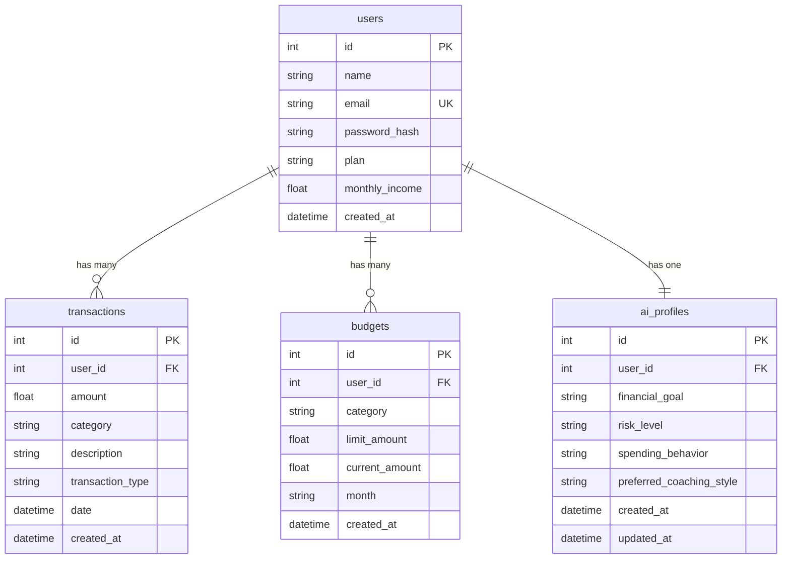

# Rapport Technique — Backend LexWise

## 1. Vue d'ensemble

**LexWise** est une API REST de coaching financier intelligent construite avec **Flask** (Python). Elle permet aux utilisateurs de suivre leurs finances (revenus, dépenses, budgets) et de recevoir des conseils personnalisés générés par un modèle d'IA (Gemma 4).

### Stack technique

| Composant | Technologie | Rôle |
|---|---|---|
| Framework web | Flask 3.1 | Serveur HTTP, routage, blueprints |
| Base de données | SQLite + SQLAlchemy 2.0 | Stockage persistant, ORM |
| Migrations | Flask-Migrate (Alembic) | Versionnement du schéma DB |
| Authentification | Flask-Login | Sessions utilisateur, protection des routes |
| Hachage mots de passe | Werkzeug | `generate_password_hash` / `check_password_hash` |
| IA | Google GenAI SDK (Gemma 4) | Coaching financier intelligent |
| Configuration | python-dotenv | Chargement des variables d'environnement |

---

## 2. Architecture du projet

```
Lexwise/
├── run.py                     # Point d'entrée — lance le serveur
├── .env                       # Variables d'environnement (clés, DB)
├── requirements.txt           # Dépendances Python
├── app/
│   ├── __init__.py            # App Factory (create_app)
│   ├── config.py              # Classe de configuration
│   ├── database/
│   │   └── db.py              # Instance SQLAlchemy
│   ├── models/                # Modèles de données (ORM)
│   │   ├── user.py
│   │   ├── transaction.py
│   │   ├── budget.py
│   │   └── ai_profile.py
│   ├── routes/                # Endpoints API (Blueprints)
│   │   ├── auth_routes.py
│   │   ├── finance_routes.py
│   │   ├── ai_routes.py
│   │   └── subscription_routes.py
│   ├── services/              # Logique métier
│   │   ├── ai_service.py
│   │   ├── finance_service.py
│   │   └── recommendation_engine.py
│   ├── templates/             # Templates HTML (vide — API pure)
│   └── static/                # Fichiers statiques (vide — API pure)
└── tests/                     # Tests automatisés (41 tests)
    ├── conftest.py
    ├── test_auth.py
    ├── test_finance.py
    └── test_ai_and_subscriptions.py
```

L'architecture suit le pattern **MVC** (Model-View-Controller) adapté à Flask :
- **Models** → `app/models/` — Définition des tables et relations
- **Views** → `app/routes/` — Endpoints HTTP (Blueprints Flask)
- **Controllers** → `app/services/` — Logique métier séparée des routes

---

## 3. Point d'entrée et App Factory

### `run.py`

```python
from app import create_app
app = create_app()
if __name__ == "__main__":
    app.run(host="0.0.0.0", port=5000, debug=True)
```

Ce fichier crée l'application Flask et lance le serveur de développement sur le port 5000.

### `app/__init__.py` — La fonction `create_app()`

C'est le cœur de l'application. Elle utilise le pattern **Application Factory** recommandé par Flask :

**Étape 1 — Chargement de la configuration :**
- `load_dotenv()` charge les variables du fichier `.env`
- `app.config.from_object(Config)` applique la configuration

**Étape 2 — Initialisation des extensions :**
- `db.init_app(app)` — Connecte SQLAlchemy à l'application
- `migrate.init_app(app, db)` — Active les migrations de base de données
- `login_manager.init_app(app)` — Active la gestion des sessions

**Étape 3 — Enregistrement des Blueprints :**
Chaque module de routes est enregistré avec un préfixe d'URL :

| Blueprint | Préfixe | Fonction |
|---|---|---|
| `auth_bp` | `/auth` | Inscription, connexion, déconnexion |
| `finance_bp` | `/finance` | Transactions, budgets, tableau de bord |
| `ai_bp` | `/ai` | Coach IA, questions-réponses |
| `subscription_bp` | `/subscriptions` | Gestion des plans (Go/Premium) |

**Étape 4 — Création des tables :**
`db.create_all()` crée automatiquement les tables SQLite si elles n'existent pas.

### Gestionnaire d'authentification

```python
@login_manager.unauthorized_handler
def unauthorized():
    return jsonify({"error": "Authentication required"}), 401
```

Quand un utilisateur non authentifié accède à une route protégée, il reçoit une erreur JSON `401` au lieu d'une redirection HTML.

---

## 4. Configuration

### `app/config.py`

| Variable | Source | Valeur par défaut | Description |
|---|---|---|---|
| `SECRET_KEY` | `SECRET_KEY` | `"change_this_secret"` | Clé de chiffrement des sessions |
| `SQLALCHEMY_DATABASE_URI` | `DATABASE_URL` | `sqlite:///lexwise.db` | Chemin vers la base de données |
| `SQLALCHEMY_TRACK_MODIFICATIONS` | — | `False` | Désactive le suivi des modifications (performance) |
| `GEMINI_API_KEY` | `GEMINI_API_KEY` | `""` | Clé API Google pour le modèle Gemma |

### `.env`

```
FLASK_ENV=development
SECRET_KEY=dev-secret-key-change-in-production
DATABASE_URL=sqlite:///financial_coach.db
GEMINI_API_KEY=your_gemini_api_key_here
```

---

## 5. Base de données et modèles

### `app/database/db.py`

Crée l'instance unique de SQLAlchemy (`db`) utilisée par tous les modèles. SQLAlchemy est un **ORM** (Object-Relational Mapper) qui permet de manipuler la base de données avec des objets Python au lieu d'écrire du SQL.

### Schéma de la base de données



### Modèle `User` (`app/models/user.py`)

Le modèle central. Hérite de `UserMixin` (Flask-Login) pour la gestion des sessions.

**Champs :**
- `name`, `email` (unique), `password_hash` — Identité
- `plan` — Plan d'abonnement (`"go"` ou `"premium"`)
- `monthly_income` — Revenu mensuel déclaré

**Relations :**
- `transactions` — Liste de toutes les transactions (1-à-N, suppression en cascade)
- `budgets` — Liste de tous les budgets (1-à-N, suppression en cascade)
- `ai_profile` — Profil IA unique (1-à-1, suppression en cascade)

Le mot de passe n'est **jamais stocké en clair**. Seul le hash (Werkzeug `pbkdf2:sha256`) est enregistré.

### Modèle `Transaction` (`app/models/transaction.py`)

Représente un mouvement financier (revenu ou dépense).

- `amount` — Montant (toujours positif)
- `category` — Catégorie (ex: "alimentation", "salaire")
- `transaction_type` — `"income"` ou `"expense"`
- `date` — Date de la transaction (UTC)

### Modèle `Budget` (`app/models/budget.py`)

Représente un plafond de dépense par catégorie et par mois.

- `category` — Catégorie concernée
- `limit_amount` — Plafond fixé par l'utilisateur
- `current_amount` — Montant actuellement dépensé (mis à jour automatiquement)
- `month` — Mois concerné (format `"YYYY-MM"`)

### Modèle `AIProfile` (`app/models/ai_profile.py`)

Stocke les préférences de coaching de l'utilisateur pour personnaliser les réponses de l'IA.

- `financial_goal` — Objectif financier (ex: "épargner pour un voyage")
- `risk_level` — Niveau de risque accepté (`"low"`, `"medium"`, `"high"`)
- `preferred_coaching_style` — Style de coaching (`"motivant"`, `"strict"`, `"balanced"`)
- `updated_at` — Se met à jour automatiquement via `onupdate`

---

## 6. Routes API (Endpoints)

### 6.1 Authentification (`/auth`)

| Méthode | Endpoint | Auth requise | Description |
|---|---|---|---|
| POST | `/auth/register` | ❌ | Créer un compte |
| POST | `/auth/login` | ❌ | Se connecter |
| POST | `/auth/logout` | ✅ | Se déconnecter |
| GET | `/auth/me` | ✅ | Obtenir les infos de l'utilisateur connecté |

**Inscription (`POST /auth/register`)** — Validations effectuées :
1. Vérifie que le body est du JSON valide
2. Vérifie les champs obligatoires (`name`, `email`, `password`)
3. Valide le format de l'email (présence de `@` et `.`)
4. Vérifie que le mot de passe fait au moins 8 caractères
5. Vérifie que l'email n'existe pas déjà (erreur 409)
6. Vérifie que le plan est valide (`"go"` ou `"premium"`)
7. Vérifie que `monthly_income` est un nombre positif
8. Hache le mot de passe avec Werkzeug
9. Crée l'utilisateur + son profil IA en base
10. En cas d'erreur, effectue un `rollback` de la transaction DB

**Connexion (`POST /auth/login`)** :
1. Vérifie l'email et le mot de passe
2. Compare le hash du mot de passe fourni avec celui en base
3. Crée une session via `login_user(user)` (cookie de session Flask)
4. Retourne les infos de l'utilisateur

**Toutes les autres routes** sont protégées par `@login_required`. Sans session active, elles retournent `{"error": "Authentication required"}` avec le code 401.

### 6.2 Finance (`/finance`)

| Méthode | Endpoint | Description |
|---|---|---|
| GET | `/finance/dashboard` | Tableau de bord complet |
| POST | `/finance/transactions` | Créer une transaction |
| GET | `/finance/transactions` | Lister les transactions |
| POST | `/finance/budgets` | Créer un budget |
| GET | `/finance/budgets` | Lister les budgets |

**Dashboard (`GET /finance/dashboard`)** — Agrège 4 sources de données :
- `summary` — Résumé mensuel (revenus, dépenses, taux d'épargne)
- `budgets` — État de chaque budget (% utilisé, statut)
- `risks` — Risques financiers détectés
- `recommendations` — Conseils personnalisés

**Création de transaction (`POST /finance/transactions`)** :
- Valide tous les champs (`amount` > 0, `transaction_type` ∈ {income, expense})
- Après création, **met à jour automatiquement** le budget correspondant si c'est une dépense (même catégorie + même mois)

**Budgets** — Filtrage par mois via query parameter : `GET /finance/budgets?month=2026-05`

### 6.3 Coach IA (`/ai`)

| Méthode | Endpoint | Description |
|---|---|---|
| GET | `/ai/coach` | Message de coaching personnalisé |
| POST | `/ai/ask` | Poser une question au coach |

Détaillé dans la section 7 (Service IA).

### 6.4 Abonnements (`/subscriptions`)

| Méthode | Endpoint | Description |
|---|---|---|
| GET | `/subscriptions/plan` | Plan actuel + fonctionnalités |
| POST | `/subscriptions/upgrade` | Changer de plan |

**Plans disponibles :**

| Plan | Fonctionnalités |
|---|---|
| `go` (gratuit) | Dashboard basique, suivi des transactions, aperçu du budget |
| `premium` | Coach IA, recommandations personnalisées, insights avancés, suivi des objectifs, score de santé financière |

---

## 7. Services (Logique métier)

### 7.1 `FinanceService` (`app/services/finance_service.py`)

Contient toute la logique de calcul financier.

**`calculate_monthly_summary(user_id)`** :
- Récupère toutes les transactions de l'utilisateur
- Filtre celles du mois courant (format `YYYY-MM`)
- Calcule : revenus totaux, dépenses totales, reste, taux d'épargne
- Ventile les dépenses par catégorie

**`analyze_budget_status(user_id)`** :
- Pour chaque budget du mois courant, calcule le pourcentage utilisé
- Attribue un statut :
  - `"safe"` — Moins de 80% du plafond
  - `"warning"` — Entre 80% et 99%
  - `"exceeded"` — 100% ou plus

**`detect_financial_risks(user_id)`** :
- Risque **HIGH** : aucun revenu enregistré ce mois
- Risque **MEDIUM** : taux d'épargne inférieur à 10%
- Risque **MEDIUM** : une catégorie dépasse 40% des dépenses totales

### 7.2 `RecommendationEngine` (`app/services/recommendation_engine.py`)

Génère des recommandations basées sur des règles :

| Condition | Type | Priorité | Conseil |
|---|---|---|---|
| Aucun revenu | `income` | High | "Ajoute tes revenus" |
| Épargne < 10% | `saving` | High | "Vise au moins 10%" |
| Catégorie dominante | `spending` | Medium | "Surveille tes dépenses en [catégorie]" |
| Aucun risque | `positive` | Low | "Bonne gestion, continue !" |

### 7.3 `AIService` (`app/services/ai_service.py`)

C'est le service le plus complexe. Il intègre le modèle **Gemma 4** (Google) pour générer des réponses intelligentes.

**Architecture en 3 couches :**

```
Requête utilisateur
        ↓
┌─ build_financial_context() ─┐
│  Collecte : user, profil,   │
│  résumé, risques, conseils   │
└──────────────┬───────────────┘
               ↓
┌─ _format_context_for_prompt() ─┐
│  Transforme les données en     │
│  texte lisible pour le LLM     │
└──────────────┬─────────────────┘
               ↓
┌─ _call_gemma() ────────────────┐
│  Envoie au modèle Gemma 4     │
│  via google-genai SDK          │
│  Si échec → fallback règles    │
└────────────────────────────────┘
```

**System Prompt** — Le modèle reçoit une instruction système qui définit sa personnalité :
- Il s'appelle "LexWise"
- Il parle en français
- Il donne des conseils concis (2-5 phrases)
- Il utilise uniquement les données réelles (jamais de chiffres inventés)
- Il adapte son ton au style de coaching de l'utilisateur

**Fallback** — Si la clé API Gemini n'est pas configurée ou si l'appel échoue, le service utilise automatiquement des réponses basées sur des règles (keyword matching sur : `dépense`, `épargne`, `budget`).

---

## 8. Sécurité

| Mesure | Implémentation |
|---|---|
| Hachage des mots de passe | Werkzeug `pbkdf2:sha256` — jamais stocké en clair |
| Sessions sécurisées | Flask-Login avec cookie signé via `SECRET_KEY` |
| Protection des routes | `@login_required` sur toutes les routes sauf register/login |
| Isolation des données | Chaque utilisateur ne voit que ses propres données (`current_user.id`) |
| Validation des entrées | Vérification de type, format, longueur sur chaque endpoint |
| Gestion des erreurs | `try/except` avec `db.session.rollback()` sur toutes les écritures |
| Variables sensibles | Stockées dans `.env`, jamais dans le code source (`.gitignore`) |

---

## 9. Tests automatisés

**41 tests** répartis en 3 fichiers, exécutés avec **pytest**.

### Configuration (`conftest.py`)

- Crée une application Flask de test avec une base SQLite **en mémoire** (`sqlite:///:memory:`)
- Nettoie la base entre chaque test
- Fournit un `authenticated_client` (utilisateur pré-inscrit et connecté)

### Couverture des tests

| Fichier | Nb tests | Couverture |
|---|---|---|
| `test_auth.py` | 16 | Inscription (succès, champs manquants, email invalide, mot de passe faible, doublon), connexion (succès, mauvais mdp, utilisateur inexistant), routes protégées, déconnexion |
| `test_finance.py` | 13 | CRUD transactions, CRUD budgets, dashboard, mise à jour auto du budget |
| `test_ai_and_subscriptions.py` | 12 | Coach IA, Q&A (dépenses, épargne, budget, général), plans, upgrade |

Commande : `venv\Scripts\python.exe -m pytest tests/ -v`

---

## 10. Flux de données — Exemple complet

Voici le parcours complet d'une requête utilisateur :

**Scénario : L'utilisateur demande un conseil au coach IA**

```
1. POST /ai/ask  {"question": "Comment réduire mes dépenses ?"}
        ↓
2. @login_required vérifie la session (cookie)
        ↓
3. AIService.answer_user_question(user_id, question)
        ↓
4. build_financial_context(user_id)
   → Requête DB : User, AIProfile, Transactions, Budgets
   → Appel FinanceService.calculate_monthly_summary()
   → Appel FinanceService.detect_financial_risks()
   → Appel RecommendationEngine.generate_recommendations()
        ↓
5. _format_context_for_prompt(context)
   → Texte structuré avec toutes les données financières
        ↓
6. _call_gemma(question, context)
   → Envoi au modèle Gemma 4 via Google GenAI SDK
   → Réponse personnalisée en français
        ↓
7. Retour JSON : {"answer": "Bonjour Thomas, ..."}
```

---

## 11. Lancer le projet

```bash
# 1. Créer et activer l'environnement virtuel
python -m venv venv
venv\Scripts\activate

# 2. Installer les dépendances
pip install -r requirements.txt

# 3. Configurer les variables d'environnement (.env)
# Modifier GEMINI_API_KEY avec votre clé API

# 4. Lancer le serveur
python run.py
# → http://127.0.0.1:5000

# 5. Lancer les tests
pytest tests/ -v
```
